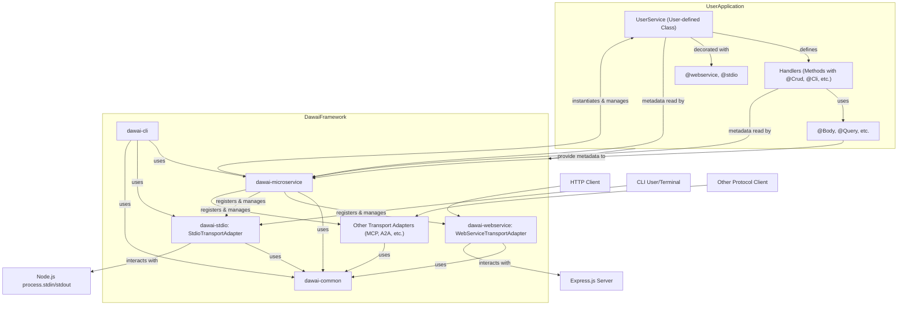

# Dawai Architecture Overview

This document provides a high-level overview of the Dawai framework's architecture. Understanding these components and their interactions is key to effectively using and extending Dawai.

## Core Principles

Dawai's architecture is built upon several core principles:

*   **Modularity**: The framework is divided into distinct, loosely coupled packages (e.g., `dawai-common`, `dawai-microservice`, `dawai-webservice`, `dawai-stdio`). This allows developers to include only the parts they need.
*   **Decorator-Driven**: TypeScript decorators are heavily used for metadata definition, configuration, and wiring components together. This promotes declarative programming and reduces boilerplate.
*   **Transport Agnostic Core**: The central `dawai-microservice` package is designed to be independent of specific communication protocols. Transport-specific logic is handled by pluggable `TransportAdapter` implementations.
*   **Service-Oriented**: Applications are built around `Service` classes, which encapsulate business logic and expose functionality through handlers.
*   **Extensibility**: Key components like `TransportAdapter` and the decorator system are designed to be extended, allowing for custom protocols, behaviors, and integrations.

## Key Architectural Components

The diagram below illustrates the main components and their relationships:

### 1. `@arifwidianto/dawai-common`
*   **Purpose**: Provides shared interfaces, decorators, types, constants, and utility functions used across all other Dawai packages.
*   **Key Contents**:
    *   `MicroserviceOptions` and related configuration interfaces.
    *   All class, method, and parameter decorators (e.g., `@webservice`, `@stdio`, `@Crud`, `@Cli`, `@Body`, `@Params`).
    *   Metadata interfaces (`HandlerMetadata`, `ParameterMetadata`).
    *   Metadata reflection keys.
    *   Common error classes (e.g., `HttpException`).

### 2. `@arifwidianto/dawai-microservice` (Core Engine)
*   **Purpose**: The central orchestrator of a Dawai application. It's responsible for loading services, managing transport adapters, and handling the application lifecycle.
*   **Key Components**:
    *   **`Microservice` Class**: The main entry point for creating and running a Dawai application.
        *   Instantiates service classes.
        *   Discovers and registers transport adapters based on configuration and class decorators.
        *   Manages the `bootstrap`, `listen`, and `close` lifecycle phases.
    *   **`AbstractTransportAdapter` Class**: An abstract base class that all transport adapters must extend. It defines the contract for how the core engine interacts with different communication protocols.
        *   Handles metadata extraction for handlers and parameters relevant to its transport.
    *   **Metadata Reflection**: Logic to read and interpret metadata attached by decorators on service classes and their methods/parameters.

### 3. Transport Adapters (e.g., `@arifwidianto/dawai-webservice`, `@arifwidianto/dawai-stdio`)
*   **Purpose**: Bridge the gap between a specific communication protocol and the Dawai core. Each adapter handles the nuances of its protocol.
*   **Responsibilities**:
    *   Initialize and manage the underlying server or client for the protocol (e.g., an Express server for HTTP, a readline interface for STDIO).
    *   Discover handlers (service methods) relevant to its transport type using metadata.
    *   Register these handlers with the underlying protocol mechanism (e.g., creating HTTP routes, defining CLI commands).
    *   When a request/command arrives:
        *   Extract parameters from the incoming data using parameter metadata.
        *   Perform Zod validation if a schema is defined for the handler.
        *   Invoke the appropriate service handler method with the extracted and validated parameters.
        *   Format and send the handler's response back to the client.
    *   Manage the lifecycle (`bootstrap`, `listen`, `close`) of the transport.
*   **Examples**:
    *   `WebServiceTransportAdapter`: Uses Express.js to handle HTTP requests, WebSockets, and SSE.
    *   `StdioTransportAdapter`: Manages CLI interactions, argument parsing, and interactive prompts.

### 4. Service Classes (User-Defined)
*   **Purpose**: Contain the application's business logic.
*   **Structure**:
    *   Standard TypeScript classes.
    *   Decorated with class decorators (e.g., `@webservice()`, `@stdio()`) to enable specific transports and provide transport-level configuration.
    *   Methods within these classes are decorated with method decorators (e.g., `@Crud()`, `@Cli()`) to expose them as handlers for specific transports.
    *   Handler method parameters are decorated with parameter decorators (e.g., `@Body()`, `@Params()`) to inject data from incoming requests/commands.

### 5. `@arifwidianto/dawai-cli`
*   **Purpose**: A command-line tool built using Dawai itself (specifically `dawai-stdio`).
*   **Functionality**:
    *   Scaffolds new Dawai applications, services, and handlers.
    *   Provides utility commands for managing Dawai projects.
*   **Significance**: Demonstrates Dawai's capability to build complex CLI tools and serves as a key developer productivity aid.

## Request/Command Lifecycle (Simplified)

**For an HTTP Request (WebServiceTransportAdapter):**
1.  HTTP client sends a request (e.g., `GET /users/123`).
2.  The underlying Express server receives the request.
3.  `WebServiceTransportAdapter` matches the request path and method to a registered handler (e.g., a method in `UserService` decorated with `@Crud({ method: 'GET', path: '/users/:id' })`).
4.  The adapter extracts parameters (e.g., `id` from path using `@Params('id')`).
5.  If a Zod schema is attached to the handler, input is validated.
6.  The corresponding `UserService` method is invoked with the extracted parameters.
7.  The method executes its logic and returns a result.
8.  `WebServiceTransportAdapter` formats the result into an HTTP response and sends it back.

**For a CLI Command (StdioTransportAdapter):**
1.  User types a command in the terminal (e.g., `my-app list-users --active`).
2.  Node.js `process.argv` is captured.
3.  `StdioTransportAdapter` parses `argv` and matches it to a registered CLI handler (e.g., a method in `CliUserService` decorated with `@Cli({ command: 'list-users' })`).
4.  The adapter extracts arguments/options (e.g., `--active` flag using `@Body()`).
5.  If a Zod schema is attached, arguments are validated.
6.  The `CliUserService` method is invoked.
7.  The method executes, potentially writing to `stdout` or `stderr` (often via `StdioContext`).
8.  The process may exit, or if in interactive mode, await further commands.

## Extensibility Points

*   **Custom Transport Adapters**: Implement `AbstractTransportAdapter` to support new protocols.
*   **Custom Decorators**: Create new class, method, or parameter decorators to add custom metadata or behavior.
*   **Middleware**: For transports like `WebServiceTransportAdapter`, standard Express middleware can be used, or custom Dawai-specific middleware patterns can be developed.
*   **Service Utilities/Base Classes**: Develop shared utilities or base service classes for common application concerns.

This architecture provides a flexible and powerful foundation for building a wide range of applications with Dawai.
